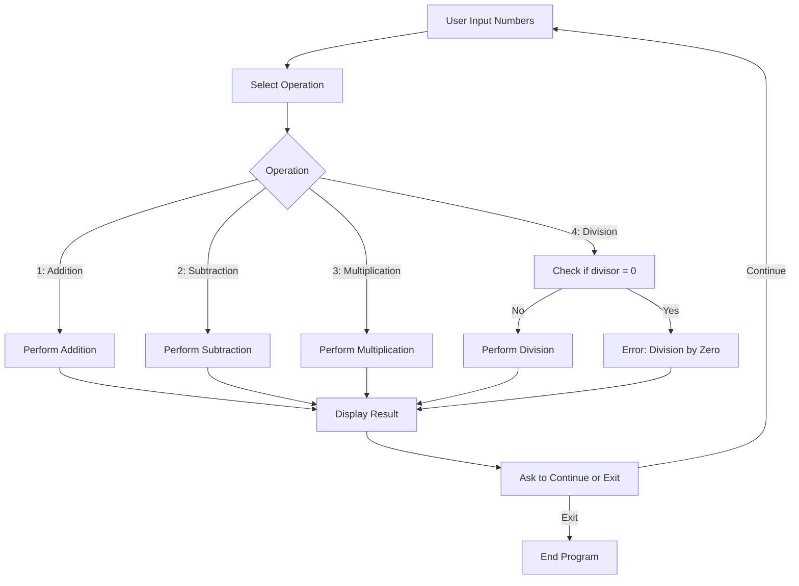
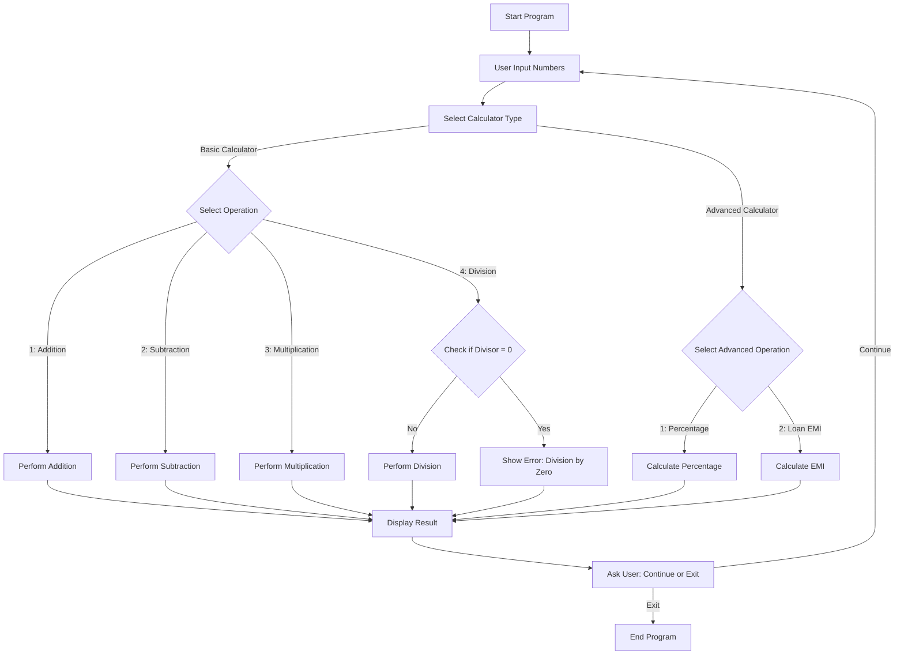

# C++ OOP Calculator

A Command-Line Calculator built in C++ that demonstrates Object-Oriented Programming (OOP) concepts.  
The program supports both basic arithmetic operations and advanced financial calculations like percentage and loan EMI computation.
---

## Table of Contents
- [Project Overview](#project-overview)
- [Goals](#goals)
- [Features](#features)
- [Application Flow](#application-flow)
- [Technologies Used](#technologies-used)
- [Project Structure](#project-structure)
- [Setup Instructions](#setup-instructions)
- [How It Works](#how-it-works)
- [Visualizations](#visualizations)
- [Example Results](#example-results)
- [Error Handling](#error-handling)
- [Future Scope](#future-scope)
- [Contributing](#contributing)
- [License](#license)
- [Contact](#contact)


## Project Overview

This is a **beginner-friendly calculator** built in **C++** that runs in the command line. It supports the four basic arithmetic operations (addition, subtraction, multiplication, division) and has built-in **input validation** and **error handling**. The project demonstrates good coding practices such as exception handling, buffer clearing, and modular programming.

---

## Goals

- Build a clean, structured **C++ CLI application**.  
- Apply **OOP concepts** like inheritance, encapsulation, and templates.  
- Provide **safe input handling** and error checking.  
- Demonstrate a **real-world use case** (loan EMI calculator).  

---

## Features

- **Basic Operations**: Addition, Subtraction, Multiplication, Division
- **Percentage Calculation**: Find percentage of a sum.  
- **Loan EMI Calculation**: Compute monthly EMI using principal, interest rate, and tenure.
- **Input Validation**: Prevents crashes from invalid inputs  
- **Division Handling**: Prevents division by zero  
- **Looping Flow**: Continue calculations until user chooses to exit  
- **Clean & Modular Code** using classes and functions

---

## Application Flow

Here’s the high-level workflow of the application:

### Flowchart

> **Note:** If the diagrams do not render, visit [Mermaid Live Editor](https://mermaid-js.github.io/mermaid-live-editor/) to view or modify them.



---

## Technologies Used

- Programming Language: C++
- Compiler: g++ / clang++ / MSVC
- IDE/Editor: Any (VS Code, CLion, Code::Blocks, etc.)

---

## Project Structure

```bash

Calculator/
│── calculator.cpp   
│── README.md        

```

## Setup Instructions

### 1. Clone the Repository:
```bash

git clone https://github.com/Sudesh-Chaudhari/C--OOP-Calculator.git
cd C--OOP-Calculator
```

### 2. Compile the Code:
```cpp
g++ calculator.cpp -o calculator
```

### 3. Run the Program:
```bash
calculator.exe      # On Windows
```

--- 

## How It Works

#### 1. The program prompts the user for two numbers.

#### 2. User selects an operation:
    - 1 → Addition
    - 2 → Subtraction
    - 3 → Multiplication
    - 4 → Division

#### 3. The result is displayed (with formatting).

#### 4. The user can continue calculations or exit.

## Visualizations

> **Note:** If the diagrams do not render, visit [Mermaid Live Editor](https://mermaid-js.github.io/mermaid-live-editor/) to view or modify them.



---

## Example Results

```yaml
Enter first number: 15
Enter second number: 3

===== Calculator =====
Enter operation:
1. Addition (+)
2. Subtraction (-)
3. Multiplication (*)
4. Division (/)
Choose: 4

Result: 5.00
Do you want to exit? (yes/no): no
```

---

## Error Handling

- If invalid input is entered → program clears input buffer and re-prompts.
- If invalid operation number (not 1–4) is entered → asks again.
- If division by zero → shows error message instead of crashing.

---

## Future Scope
- Add advanced operations like:
    - Power (^)
    - Modulus (%)
- Implement calculation history feature.
- Build a GUI version with Qt/GTK.
- Create a scientific calculator version.

---

## Contributing
Contributions are welcome! Feel free to fork the repo, open issues, or submit pull requests.

---

## License


---

## Contact
For queries or collaborations, reach me via:

- Email: chaudharisudesh0412@gmail.com
- LinkedIn: [Sudesh Chaudhari](https://www.linkedin.com/in/sudesh-chaudhari)
